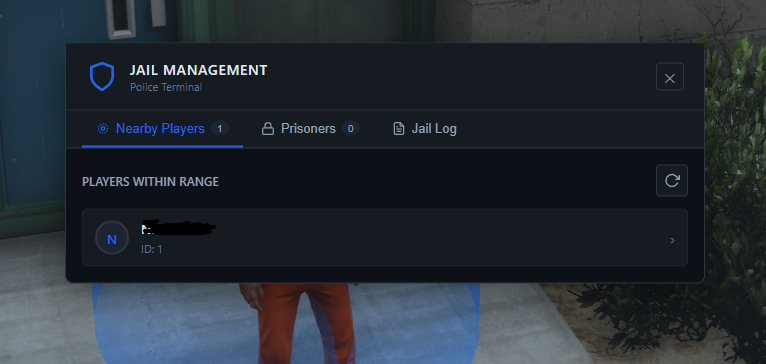
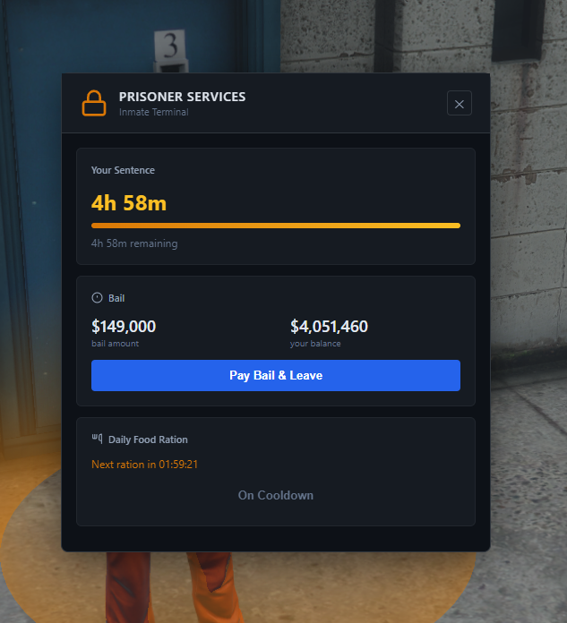
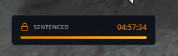

# esx_betterjail

Simple jail system for ESX Legacy with a clean UI.

## Features

- Police can jail nearby players
- Add time to existing sentences
- Prisoner services menu (bail, food rations)
- Jail log with filters
- Fully translated (English, German, Russian)

## Screenshots

### Police UI


### Prisoner Menu


### Jail Timer


## Installation

1. Drop `esx_betterjail` into your resources folder
2. Add this to your database:
```sql
ALTER TABLE `users` ADD COLUMN `jail_time` INT DEFAULT 0;
```
3. Add `ensure esx_betterjail` to server.cfg
4. Restart server

## Configuration

Edit `config.lua`:

```lua
Config.locale = 'en'  -- Language: 'en', 'de', 'ru'

Config.jailtimeDefault = 300  -- Default sentence (minutes)
Config.jailtimeMax     = 360  -- Max sentence
Config.jailtimeMin     = 1    -- Min sentence

-- Portal locations
Config.jailMenuPoint     = { x = 1690.0, y = 2592.0, z = 45.67 }
Config.spawnPoint        = { x = 1691.1, y = 2564.86, z = 47.37 }
Config.releasePoint      = { x = 1852.0, y = 2585.0, z = 45.6 }

-- Jobs that can jail
Config.jobsThatCanJail = {
    ['police'] = true,
    ['fbi']    = true,
}
```

## Commands

- `/jaillist` - Open prisoner list (police only)
- `/jailzone` - Show jail zone radius (admin only)
- `/jailtp` - Teleport to jail portal (admin only)
- `/jailmenu` - Force open menu (admin only)

## Usage

**For Police:**
1. Go to the jail portal (blue marker)
2. Press E to open menu
3. Select nearby player or manage prisoners
4. Set time and reason, then jail

**For Prisoners:**
1. Find the prisoner services portal (orange marker)
2. Press E to open menu
3. Pay bail or collect food rations

## Dependencies

- es_extended
- oxmysql
- esx_status (optional, for food rations)
- skinchanger (optional, for jail outfit)

## Credits

Made for ESX Legacy
